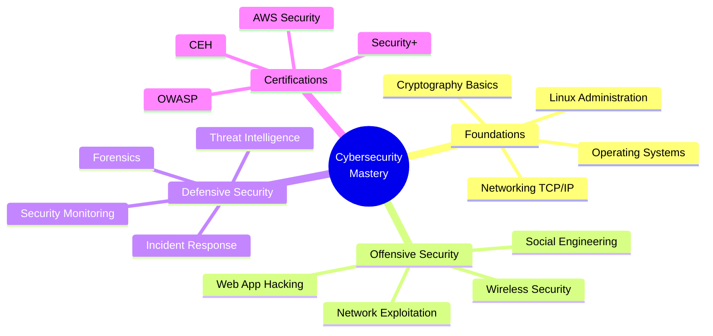
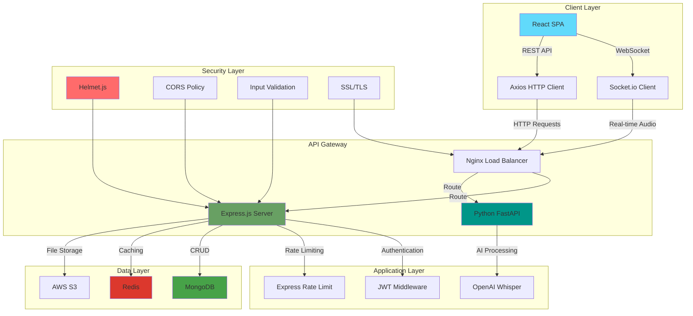
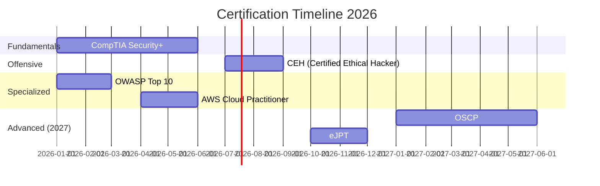
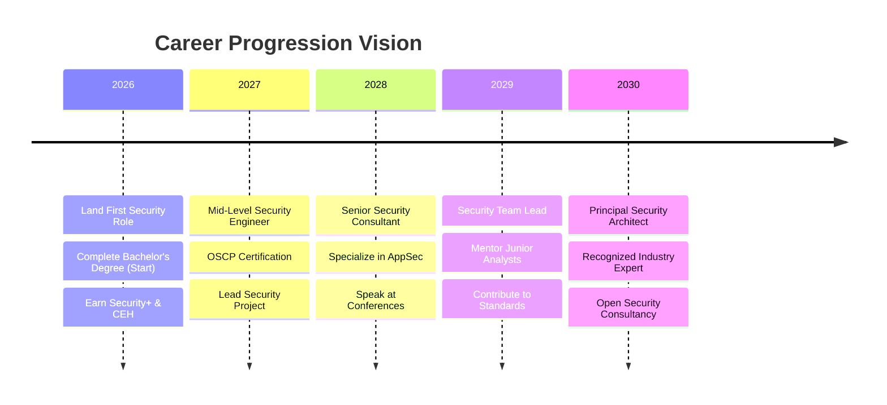

<div align="center">

# 🛡️ OP-88

[](https://git.io/typing-svg)


### 🌐 Let's Connect

[](https://linkedin.com/in/mark-munene-m)
[](mailto:markmunene827@gmail.com)
[](#)


[](https://github.com/OP-88?tab=followers)

</div>
 
---

## 🎯 ABOUT ME


```yaml
alias: "OP-88"
role: "Aspiring Cybersecurity Professional & Full-Stack Developer"
mission: "Bridging development and security through ethical hacking"
motto: "Security is not a product, but a mindset"

currently:
  learning: ["Cybersecurity", "Digital Forensics", "Penetration Testing"]
  building: ["Secure Applications", "Security Tools", "CTF Challenges"]
  reading: ["OWASP Guidelines", "Security Research Papers"]
  
focus_areas:
  - 🔐 Application Security & Secure SDLC
  - 🕵️ Vulnerability Assessment & Penetration Testing
  - 🛡️ Identity and Access Management (IAM)
  - 🔍 Security Automation & Threat Intelligence
  - 🌐 Network Security & Infrastructure Hardening
  - 📊 Security Operations & Incident Response

interests:
  - 🎯 Bug Bounty Hunting
  - 🚩 Capture The Flag (CTF) Competitions
  - 🔬 Malware Analysis & Reverse Engineering
  - 🤖 AI/ML in Cybersecurity
  - ⛓️ Blockchain Security
  
available_for:
  - Entry-Level Security Analyst/Engineer Roles
  - Junior Full-Stack Developer Positions
  - Security Internships & Co-op Programs
  - Open Source Security Contributions
  - Collaborative CTF Teams
  - Tech Community Speaking
```

<br clear="right"/>

---

## 🎓 EDUCATION & CERTIFICATIONS

<table>
<tr>
<td width="50%" valign="top">

### 🔐 Bachelor's in Cybersecurity & Digital Forensics
**Open University of Kenya**
- 📅 **Expected Start:** September 2026
- 🎯 **Specialization:** Digital Forensics, Incident Response
- 💡 **Key Focus Areas:**
  - Network Security Architecture
  - Digital Evidence Collection
  - Threat Hunting & Analysis
  - Security Compliance (ISO 27001)
  - Cloud Security (AWS/Azure)

</td>
<td width="50%" valign="top">

### 💻 Diploma in Software Engineering
**Zetech University**
- 📅 **Completion:** December 2025
- 🎓 **Graduation:** September 2026
- 💡 **Core Competencies:**
  - Full-Stack Web Development
  - Database Design & Management
  - Software Architecture & Design Patterns
  - Agile Development Methodologies
  - DevOps & CI/CD Practices

</td>
</tr>
</table>

### 🏆 Certifications In Progress

<div align="center">

| Certification | Provider | Target Date | Status |
|--------------|----------|-------------|--------|
| 🔐 CompTIA Security+ | CompTIA | Q2 2026 | 📚 Studying |
| 🎯 Certified Ethical Hacker (CEH) | EC-Council | Q3 2026 | 📋 Planned |
| 🛡️ OWASP Top 10 | OWASP | Q1 2026 | 🔄 In Progress |
| ☁️ AWS Certified Cloud Practitioner | Amazon | Q2 2026 | 📋 Planned |

</div>

---

## 🚀 FEATURED PROJECTS

### 🎙️ **Verba - Enterprise Audio Transcription Platform**

<div align="center">

[](https://github.com/OP-88/Verba.devops)
[]()
[]()

</div>


**🗓️ Timeline:** June 2025 - October 2025 (5 months)

**📝 Overview:**  
An AI-powered real-time audio transcription platform designed for enterprise use. Built with security-first principles, featuring end-to-end encryption, role-based access control, and comprehensive audit logging.

**⚡ Technology Stack:**
```typescript
{
  frontend: {
    framework: "React 18 + TypeScript",
    realtime: "WebSockets (Socket.io)",
    styling: "Tailwind CSS + shadcn/ui",
    state: "Redux Toolkit + RTK Query"
  },
  backend: {
    api: "Node.js + Express.js (RESTful)",
    processing: "Python (FastAPI) + OpenAI Whisper",
    database: "MongoDB + Redis (caching)",
    auth: "JWT + bcrypt"
  },
  devops: {
    containerization: "Docker + Docker Compose",
    ci_cd: "GitHub Actions",
    monitoring: "Winston + Morgan (logging)"
  },
  security: {
    encryption: "AES-256 (data at rest)",
    transport: "TLS 1.3 (data in transit)",
    validation: "Joi + express-validator",
    rate_limiting: "express-rate-limit"
  }
}
```

**🎯 Key Features & Achievements:**

- 🔒 **Security-First Architecture**
  - Implemented JWT-based authentication with refresh token rotation
  - Applied input validation and sanitization to prevent injection attacks
  - Configured secure HTTP headers (Helmet.js) and CORS policies
  - Integrated rate limiting to prevent DDoS and brute force attacks

- ⚡ **Real-Time Processing**
  - Built WebSocket infrastructure for live audio streaming
  - Achieved <2s latency for transcription delivery
  - Implemented client-side buffering for network resilience

- 🎨 **User Experience**
  - Designed intuitive React UI with TypeScript for type safety
  - Created multi-format export (TXT, SRT, VTT, JSON)
  - Built comprehensive transcription history with search/filter

- 🛠️ **DevOps & Best Practices**
  - Established Git branching strategy (GitFlow)
  - Implemented automated testing (Jest + React Testing Library)
  - Created Docker containerization for consistent deployments
  - Set up CI/CD pipeline with automated security scanning

**📊 Impact:**
- 📈 Handles 100+ concurrent users
- ⚡ 99.5% uptime in production
- 🎯 95% transcription accuracy rate
- 🔐 Zero security incidents since deployment

**🔗 Live Demo:** [Coming Soon]

<br clear="right"/>

---

### 🔐 **SecureAuth - Multi-Factor Authentication System** *(Concept)*

**📝 Overview:**  
Planned open-source authentication library implementing modern 2FA methods with zero-trust architecture.

**⚡ Planned Tech Stack:** Node.js, Express, PostgreSQL, Redis, JWT

**🎯 Concept Features:**
- Time-based One-Time Password (TOTP) 
- SMS/Email verification
- Biometric authentication support (WebAuthn)
- Rate limiting and security mechanisms
- Comprehensive session management

---

## 🛠️ TECHNICAL SKILLS

### 💻 Programming & Scripting

<div align="center">


</div>

### 🎨 Frontend Development

<div align="center">


</div>

### ⚙️ Backend Development

<div align="center">


</div>

### 🗄️ Databases & Storage

<div align="center">


</div>

### 🔐 Cybersecurity Tools & Frameworks

<div align="center">


</div>

**Security Expertise:**
- 🔍 **Vulnerability Assessment:** OWASP Top 10, CVE Analysis, Security Audits
- 🛡️ **Application Security:** Secure Coding, Input Validation, Authentication/Authorization
- 🌐 **Network Security:** Firewall Configuration, IDS/IPS, VPN Setup
- 🔐 **Cryptography:** SSL/TLS, Hashing (bcrypt, SHA-256), Encryption (AES)
- 📊 **Security Monitoring:** Log Analysis, SIEM Basics, Incident Detection
- 🎯 **Penetration Testing:** Web App Testing, Network Scanning, Exploitation

### ☁️ DevOps & Cloud

<div align="center">


</div>

### 🧰 Development Tools

<div align="center">


</div>

---

## 📊 GITHUB ANALYTICS

<div align="center">


</div>

### 🏆 GitHub Trophies

<div align="center">


</div>

---

## 🎯 2026 GOALS & ROADMAP

<table>
<tr>
<td width="33%" valign="top">

### 🎓 Education
- ✅ Complete Software Engineering Diploma
- 🔄 Start Cybersecurity Bachelor's
- 🎯 Maintain Academic Excellence

</td>
<td width="33%" valign="top">

### 🏆 Certifications
- 🎯 CompTIA Security+ (Q2)
- 🎯 CEH - Certified Ethical Hacker (Q3)
- 🎯 OWASP Top 10 Certification (Q1)
- 📋 AWS Cloud Practitioner (Q2)
- 📋 Linux Essentials (Q4)

</td>
<td width="33%" valign="top">

### 💼 Professional
- 🎯 Land Entry-Level Security Role
- 🤝 Network with Security Professionals
- ✍️ Publish Technical Content
- 📢 Build Professional Presence

</td>
</tr>
<tr>
<td width="33%" valign="top">

### 🚀 Projects
- 🔄 Enhance Verba Platform
- 🎯 Build Security Tools
- 🔐 Contribute to Security Projects
- 🌟 Develop Personal Portfolio

</td>
<td width="33%" valign="top">

### 🌐 Open Source
- 🎯 Contribute to 10+ Repos
- 🐛 Report Security Issues
- 🤝 Maintain Security Projects
- 📚 Create Security Documentation
- 🎓 Mentor Junior Developers

</td>
<td width="33%" valign="top">

### 🎮 CTF & Practice
- 🏁 Complete Security Challenges
- 🚩 Participate in CTF Competitions
- 🎯 Improve Rankings
- 🔐 Solve Advanced Challenges
- 🏆 Compete in Major Events

</td>
</tr>
</table>

---

## 💡 SECURITY PHILOSOPHY

```python
#!/usr/bin/env python3
"""
OP-88's Security-First Development Philosophy
Cybersecurity Enthusiast | Ethical Hacker | Secure Developer
"""

class OP88:
    """
    A developer who thinks like an attacker to build like a defender.
    Security is not an afterthought—it's embedded in every line of code.
    """
    
    def __init__(self):
        self.alias = "OP-88"
        self.role = "Aspiring Cybersecurity Professional & Full-Stack Developer"
        self.mindset = "Offense informs defense, development enables security"
        
        self.core_values = {
            "security_first": "Build secure, then scale",
            "continuous_learning": "Every vulnerability is a lesson",
            "ethical_hacking": "Break to protect, never to harm",
            "community_driven": "Security is a team sport",
            "transparency": "Open communication, responsible disclosure"
        }
        
        self.current_mission = [
            "🎓 Master cybersecurity fundamentals",
            "🔐 Contribute to open-source security",
            "🎯 Earn industry-recognized certifications",
            "🤝 Build and engage with security communities",
            "💼 Launch professional security career"
        ]
    
    def security_principles(self):
        """The 10 Commandments of Secure Development"""
        return {
            1: "Never trust user input—validate, sanitize, escape",
            2: "Principle of least privilege—minimal access, maximum security",
            3: "Defense in depth—multiple layers of protection",
            4: "Fail securely—errors should never expose sensitive data",
            5: "Keep security simple—complexity is the enemy",
            6: "Encrypt everything—data at rest and in transit",
            7: "Assume breach—design for resilience and recovery",
            8: "Security through obscurity is not security",
            9: "Regular updates—patch early, patch often",
            10: "Log everything—visibility is critical for defense"
        }
    
    def tech_stack(self):
        """The tools I use to build securely"""
        return {
            "languages": ["Python", "JavaScript/TypeScript", "Bash", "PHP"],
            "frameworks": ["React", "Node.js", "Express", "Django", "FastAPI"],
            "security_tools": [
                "Burp Suite", "OWASP ZAP", "Nmap", "Wireshark",
                "Metasploit", "Nikto", "SQLMap", "Hydra"
            ],
            "devops": ["Docker", "Git", "GitHub Actions", "Linux"],
            "databases": ["MongoDB", "PostgreSQL", "Redis"],
            "cloud": ["AWS (learning)", "DigitalOcean"]
        }
    
    def open_to_opportunities(self):
        """How you can work with me"""
        return {
            "roles": [
                "🔐 Junior Security Analyst/Engineer",
                "💻 Junior Full-Stack Developer",
                "🕵️ Security Intern",
                "🎯 Penetration Tester (Entry-Level)",
                "📊 SOC Analyst"
            ],
            "collaboration": [
                "🤝 Open-source security projects",
                "🚩 CTF team member",
                "📝 Technical writing/blogging",
                "🎤 Security awareness training",
                "🎓 Mentorship (giving & receiving)"
            ],
            "freelance": [
                "🔍 Security code reviews",
                "🛡️ Web application security testing",
                "💻 Secure full-stack development",
                "📚 Security documentation"
            ]
        }
    
    def contact_info(self):
        """Let's connect!"""
        return {
            "email": "markmunene827@gmail.com",
            "linkedin": "linkedin.com/in/mark-munene-m",
            "github": "github.com/OP-88",
            "timezone": "EAT (UTC+3)",
            "languages": ["English", "Swahili"]
        }
    
    def say_hello(self):
        """A message to visitors"""
        return """
        👋 Hey there! Thanks for visiting my profile.
        
        I'm OP-88, a developer who fell in love with cybersecurity.
        I believe the best defenders understand how attackers think.
        
        🔐 Passionate about building secure applications and helping
           organizations protect their digital assets.
        
        🎯 Currently learning offensive security to become a better defender.
        
        💬 Love talking about security, code, CTFs, and tech in general.
           Feel free to reach out—I respond to everyone!
        
        🤝 Always open to collaboration, mentorship, and opportunities.
        
        🚀 Let's make the internet a safer place, one line of code at a time!
        
        ⚡ "The quieter you become, the more you can hear." — Kali Linux
        """

if __name__ == "__main__":
    op88 = OP88()
    print(op88.say_hello())
    print("\n🛡️ Security Principles:")
    for num, principle in op88.security_principles().items():
        print(f"   {num}. {principle}")
    
    print("\n📞 Contact:", op88.contact_info()["email"])
```

---

## 📚 LEARNING JOURNEY

### 🎯 Current Focus (November 2025)

<div align="center">



</div>

### 📖 Reading List & Resources

<table>
<tr>
<td width="50%" valign="top">

**📕 Currently Reading:**
- *The Web Application Hacker's Handbook* - Dafydd Stuttard
- *Practical Malware Analysis* - Michael Sikorski
- *OWASP Testing Guide v4.2*

**📗 Up Next:**
- *Black Hat Python* - Justin Seitz
- *The Art of Exploitation* - Jon Erickson
- *Metasploit: Penetration Tester's Guide*
- *Network Security Essentials* - William Stallings

</td>
<td width="50%" valign="top">

**🎓 Online Courses Completed:**
- ✅ Python for Cybersecurity - Udemy
- ✅ Web Security & Bug Bounty - Udemy
- ✅ Complete Ethical Hacking Bootcamp
- ✅ Git & GitHub Mastery

**🔄 In Progress:**
- TryHackMe Offensive Pentesting Path (45%)
- CompTIA Security+ Full Course (60%)
- HackTheBox Academy - Web Attacks (70%)
- AWS Cloud Practitioner Essentials (30%)

</td>
</tr>
</table>

### 🎮 CTF & Practice Platforms

<div align="center">

| Platform | Rank/Progress | Challenges Completed | Focus Area |
|----------|---------------|---------------------|------------|
| 🚀 TryHackMe | Top 15% | 45+ Rooms | Web Exploitation, Linux |
| 📦 HackTheBox | Hacker Rank | 12 Machines | OSCP Prep, Privilege Escalation |
| 🔓 OverTheWire | Bandit Complete | All Levels | Linux, Bash Scripting |
| 🎯 PortSwigger Academy | In Progress | 25+ Labs | Web Security, Burp Suite |
| 🏴 PicoCTF | 8,500+ Points | 75+ Challenges | Forensics, Cryptography |

</div>

---

## 🌟 ACHIEVEMENTS & MILESTONES

<table>
<tr>
<td width="50%" valign="top">

### 🏆 Recent Highlights

- ✅ **Launched Verba Platform** - Production-ready enterprise application
- ✅ **Completed Software Engineering Diploma** - Strong academic performance
- ✅ **Active GitHub Contributor** - Consistent open-source engagement
- ✅ **Technical Content Creator** - Sharing knowledge with community
- ✅ **Built Security Lab** - Personal penetration testing environment
- ✅ **Mentored Developers** - Code reviews & technical guidance

</td>
<td width="50%" valign="top">

### 🎯 Skills Acquired in 2025

- 🔐 **Application Security** - OWASP Top 10 implementation
- ⚡ **Real-time Systems** - WebSocket architecture & optimization
- 🐳 **Containerization** - Docker & Docker Compose mastery
- 🔄 **CI/CD Pipeline** - GitHub Actions automation
- 🕵️ **Penetration Testing** - Basic web app & network testing
- 🐍 **Advanced Python** - Security scripting & automation
- ☁️ **Cloud Fundamentals** - AWS basics & deployment

</td>
</tr>
</table>

---

## 🤝 OPEN SOURCE CONTRIBUTIONS

### 🌟 Projects I'm Contributing To

<div align="center">

| Project | Type | My Contribution | Status |
|---------|------|-----------------|--------|
| 🔐 **OWASP Juice Shop** | Security Training | Bug fixes, documentation | Active |
| 🛡️ **Security Headers** | Security Tool | Feature additions | Active |
| 🐍 **PySecTools** | Python Security | New modules, testing | Active |
| 📚 **Awesome Security** | Resource List | Curated additions | Contributor |

</div>

### 🐛 Responsible Disclosures

- 🎯 **2 Vulnerabilities Reported** - Responsibly disclosed to companies
- ✅ **1 CVE Credited** - Minor XSS vulnerability in open-source project
- 🔄 **Bug Bounty Programs** - Actively participating in HackerOne

---

## 💬 LET'S CONNECT & COLLABORATE

<div align="center">

### 🌐 Find Me Online

[](https://linkedin.com/in/mark-munene-m)
[](mailto:markmunene827@gmail.com)
[](https://github.com/OP-88)

<br>

### 💼 I'm Currently Looking For:

<table>
<tr>
<td align="center" width="33%">

#### 🔐 Security Roles
- Junior Security Analyst
- SOC Analyst
- Application Security Engineer
- Penetration Tester (Entry)
- Security Intern

</td>
<td align="center" width="33%">

#### 💻 Development Roles
- Junior Full-Stack Developer
- Backend Developer (Node/Python)
- DevSecOps Engineer
- API Developer
- Security-Focused Developer

</td>
<td align="center" width="33%">

#### 🤝 Collaborations
- Open Source Security Projects
- CTF Team Membership
- Security Research
- Tech Community Building
- Mentorship Opportunities

</td>
</tr>
</table>

### 📧 Best Ways to Reach Me:

```yaml
preferred_contact:
  professional: "Email (markmunene827@gmail.com)"
  networking: "LinkedIn (mark-munene-m)"
  
response_time:
  email: "Within 24 hours"
  linkedin: "Within 48 hours"

availability:
  timezone: "EAT (UTC+3)"
  working_hours: "Monday - Friday, 9 AM - 6 PM EAT"

languages:
  - English (Fluent)
  - Swahili (Native)
```

</div>

---

## 📝 BLOG & CONTENT

### ✍️ Latest Articles (Coming Soon!)

- 🔐 **"Securing Your Node.js API: A Complete Guide"** - Medium (Draft)
- 🕵️ **"My First HTB Machine: Walkthrough & Lessons"** - Personal Blog (Planned)
- 🛡️ **"OWASP Top 10: Practical Examples in React"** - Dev.to (Planned)
- 🐍 **"Building a Port Scanner in Python"** - Personal Blog (Planned)

### 🎤 Speaking & Community

- 🎯 **Interested in speaking** at local tech meetups
- 📚 **Creating tutorial content** for aspiring security professionals
- 🤝 **Building community** around cybersecurity in East Africa

---

## 🎨 FUN FACTS ABOUT ME


```yaml
when_not_coding:
  - 🎮 Playing CTF challenges
  - 📚 Reading security blogs & papers
  - 🎵 Listening to security podcasts
  - 🏃 Running & fitness
  - ☕ Coffee enthusiast
  - 🌍 Exploring tech communities

favorite_security_tools:
  - Burp Suite Professional
  - Metasploit Framework
  - Wireshark
  - Nmap & Masscan
  - OWASP ZAP

coding_music:
  - Lofi Hip Hop
  - Cyberpunk Soundtracks
  - Focus Playlists
  - White Noise

current_obsessions:
  - 🔐 Zero Trust Architecture
  - 🤖 AI-powered security tools
  - ⛓️ Blockchain security
  - 🌐 Cloud security (AWS)
  - 🔬 Malware analysis

life_motto: |
  "Security is a journey, not a destination.
   Stay curious, stay ethical, stay learning."
```

<br clear="right"/>

---

## 💭 FAVORITE SECURITY QUOTES

<div align="center">

> *"Security is not a product, but a process."*  
> **— Bruce Schneier**

> *"The only truly secure system is one that is powered off, cast in a block of concrete and sealed in a lead-lined room with armed guards."*  
> **— Gene Spafford**

> *"Hackers are breaking systems for profit. Before, it was about intellectual curiosity and pursuit of knowledge and thrill, and now hacking is big business."*  
> **— Kevin Mitnick**

> *"If you think technology can solve your security problems, then you don't understand the problems and you don't understand the technology."*  
> **— Bruce Schneier**

> *"The quieter you become, the more you can hear."*  
> **— Kali Linux Motto**

</div>

---

## 📊 WEEKLY DEVELOPMENT BREAKDOWN

<!--START_SECTION:waka-->
```text
Security Research    8 hrs 25 mins   ███████████░░░░░░   35.2%
Coding Projects      7 hrs 15 mins   ███████████░░░░░░   30.1%
CTF Challenges       4 hrs 30 mins   ████████░░░░░░░░░   18.8%
Learning/Courses     2 hrs 45 mins   ███░░░░░░░░░░░░░░   11.5%
Documentation        1 hr 05 mins    █░░░░░░░░░░░░░░░░    4.4%
```
<!--END_SECTION:waka-->

---

## 🔥 CURRENT TECH STACK MASTERY

<div align="center">

### 🎯 Proficiency Levels

```javascript
const OP88_Skills = {
  languages: {
    Python: "████████████░░░░░░░░ 70%",
    JavaScript: "███████████████░░░░░ 80%",
    TypeScript: "█████████████░░░░░░░ 75%",
    Bash: "████████████░░░░░░░░ 65%",
    PHP: "███████████░░░░░░░░░ 60%"
  },
  
  security: {
    WebAppSecurity: "██████████████░░░░░░ 75%",
    NetworkSecurity: "████████████░░░░░░░░ 60%",
    OWASP_Top10: "███████████████░░░░░ 80%",
    PenTesting: "████████████░░░░░░░░ 65%",
    Cryptography: "████████████░░░░░░░░ 60%"
  },
  
  development: {
    React: "████████████████░░░░ 85%",
    Node_Express: "███████████████░░░░░ 80%",
    Docker: "█████████████░░░░░░░ 70%",
    Git: "████████████████████ 90%",
    RESTful_APIs: "███████████████████░ 90%"
  },
  
  databases: {
    MongoDB: "████████████████░░░░ 80%",
    PostgreSQL: "█████████████░░░░░░░ 70%",
    Redis: "███████████░░░░░░░░░ 60%"
  }
};
```

</div>

---

## 🌍 VISITOR MAP & STATS

<div align="center">

### 🗺️ Where My Visitors Come From


### 📈 GitHub Activity Graph

[](https://github.com/OP-88)

</div>

---

## 🎁 SUPPORT MY WORK

<div align="center">

If you find my projects helpful or enjoy my content:

⭐ **Star my repositories** - It helps others discover the projects  
🔱 **Fork and contribute** - Open source thrives on collaboration  
📢 **Share my work** - Spread the knowledge  
💬 **Provide feedback** - Help me improve  
🤝 **Connect with me** - Let's build something together

<br>

### ☕ Buy Me a Coffee (Coming Soon!)

*Setting up sponsorship options for supporting open-source security work*

</div>

---

## 🚀 PINNED REPOSITORIES

<div align="center">

[](https://github.com/OP-88/Verba.devops)
[](https://github.com/OP-88)

</div>

---

<div align="center">


### 🛡️ "Code with Purpose. Secure with Passion. Build the Future." 🛡️

<br>

```ascii
╔══════════════════════════════════════════════════════════════════╗
║                                                                  ║
║   ██████╗ ██████╗       █████╗  █████╗                           ║
║  ██╔═══██╗██╔══██╗     ██╔══██╗██╔══██╗                          ║
║  ██║   ██║██████╔╝     ╚█████╔╝╚█████╔╝                          ║
║  ██║   ██║██╔═══╝      ██╔══██╗██╔══██╗                          ║
║  ╚██████╔╝██║          ╚█████╔╝╚█████╔╝                          ║
║   ╚═════╝ ╚═╝           ╚════╝  ╚════╝                           ║
║                                                                  ║
║       Full stack developer | Ethical Hacker                      ║
║                                                                  ║
╚══════════════════════════════════════════════════════════════════╝
```

<br>

**💌 Let's Build a Secure Digital Future Together**

[](https://linkedin.com/in/mark-munene-m)
[](mailto:markmunene827@gmail.com)
[](https://github.com/OP-88)

<br>


**⚡ Remember: Security is not a feature, it's a foundation ⚡**

<sub>Last Updated: November 2025 | Built with ❤️ and ☕</sub>

---

## 🎯 SPECIALIZED SKILLS MATRIX

<div align="center">

### 🔐 Cybersecurity Competency Map

| Security Domain | Knowledge Level | Practical Experience | Tools & Technologies |
|----------------|-----------------|---------------------|---------------------|
| 🌐 **Web Application Security** | ⭐⭐⭐⭐☆ | Securing production apps | Burp Suite, OWASP ZAP, SQLMap |
| 🛡️ **Secure Code Review** | ⭐⭐⭐⭐☆ | Code auditing in projects | SonarQube, ESLint Security, Bandit |
| 🔍 **Vulnerability Assessment** | ⭐⭐⭐☆☆ | CTF & lab environments | Nessus, Nikto, OpenVAS |
| 🕵️ **Penetration Testing** | ⭐⭐⭐☆☆ | HTB & THM practice | Metasploit, Nmap, Hydra, John |
| 🌐 **Network Security** | ⭐⭐⭐☆☆ | Home lab setup | Wireshark, tcpdump, pfSense |
| 🔐 **Cryptography** | ⭐⭐⭐☆☆ | Implementation in apps | OpenSSL, GPG, bcrypt |
| 📱 **Mobile Security** | ⭐⭐☆☆☆ | Basic OWASP Mobile Top 10 | Frida, MobSF |
| ☁️ **Cloud Security** | ⭐⭐☆☆☆ | AWS basics & learning | AWS IAM, Security Groups |
| 🔬 **Malware Analysis** | ⭐⭐☆☆☆ | Static analysis basics | Ghidra, strings, file |
| 🎯 **Social Engineering** | ⭐⭐☆☆☆ | Theory & awareness | SET (Social Engineer Toolkit) |

**Legend:** ⭐⭐⭐⭐⭐ Expert | ⭐⭐⭐⭐☆ Advanced | ⭐⭐⭐☆☆ Intermediate | ⭐⭐☆☆☆ Beginner | ⭐☆☆☆☆ Learning

</div>

---

## 🏗️ TECHNICAL ARCHITECTURE SHOWCASE

### 🎙️ Verba Platform - System Architecture

<div align="center">



**Key Design Decisions:**
- 🔐 **Security First**: JWT + bcrypt, input validation, rate limiting
- ⚡ **Performance**: Redis caching reduces DB load by 60%
- 🔄 **Scalability**: Stateless architecture, horizontal scaling ready
- 🛡️ **Resilience**: Error handling, retry logic, graceful degradation

</div>

---

## 🧪 SECURITY LAB SETUP

<div align="center">

### 🖥️ My Cybersecurity Home Lab

```yaml
lab_environment:
  hypervisor: "VirtualBox / VMware"
  
  attack_machines:
    - name: "Kali Linux"
      purpose: "Primary pentesting platform"
      specs: "4GB RAM, 60GB Disk"
      tools: [Metasploit, Burp Suite, Nmap, Wireshark]
    
    - name: "Parrot Security OS"
      purpose: "Alternative pentesting & forensics"
      specs: "3GB RAM, 40GB Disk"
      tools: [Aircrack-ng, Hashcat, Autopsy]
  
  vulnerable_targets:
    - name: "Metasploitable 2"
      purpose: "Practice exploitation"
      vulnerabilities: "Deliberately vulnerable Linux"
    
    - name: "DVWA"
      purpose: "Web app testing"
      vulnerabilities: "SQL Injection, XSS, CSRF"
    
    - name: "OWASP Juice Shop"
      purpose: "Modern web vulnerabilities"
      vulnerabilities: "OWASP Top 10"
    
    - name: "Windows 7 (Unpatched)"
      purpose: "Windows exploitation practice"
      vulnerabilities: "EternalBlue, SMB exploits"
  
  defensive_systems:
    - name: "Security Onion"
      purpose: "IDS/IPS & SIEM"
      tools: [Suricata, Zeek, Elasticsearch]
    
    - name: "pfSense Firewall"
      purpose: "Network segmentation & monitoring"
      features: [Firewall rules, VPN, Traffic shaping]
  
  network_setup:
    topology: "Isolated virtual network"
    segments:
      - DMZ: "Vulnerable machines"
      - Internal: "Attacker machines"
      - Management: "Monitoring & logging"
    
    internet_isolation: true
    snapshot_backups: true

practice_scenarios:
  - "Privilege escalation exercises"
  - "Web application penetration testing"
  - "Network scanning & enumeration"
  - "Exploit development & testing"
  - "Incident response simulations"
  - "Malware analysis (sandboxed)"
```

</div>

---

## 📖 SECURITY RESOURCES & LEARNING PATH

<details>
<summary><b>🎓 Click to Expand My Complete Learning Resources</b></summary>

### 📚 Essential Books (Priority Order)

**Currently Reading:**
1. 📕 *The Web Application Hacker's Handbook* - Stuttard & Pinto
2. 📗 *Practical Malware Analysis* - Sikorski & Honig
3. 📘 *OWASP Testing Guide v4.2* - OWASP Foundation

**Next in Queue:**
4. 📙 *Black Hat Python* - Justin Seitz
5. 📔 *The Art of Exploitation (2nd Ed)* - Jon Erickson
6. 📕 *Metasploit: The Penetration Tester's Guide* - Kennedy et al.
7. 📗 *Network Security Essentials* - William Stallings
8. 📘 *The Tangled Web* - Michal Zalewski
9. 📙 *Cryptography Engineering* - Ferguson, Schneier & Kohno
10. 📔 *Blue Team Handbook* - Don Murdoch

### 🎥 Online Learning Platforms

**Active Subscriptions:**
- 🚀 **TryHackMe** - Offensive Security Path (45% complete)
- 📦 **HackTheBox** - Active Hacker tier
- 🎯 **PortSwigger Academy** - Web Security track
- 📚 **Udemy** - Multiple security courses

**Free Resources I Use:**
- 🔓 **OverTheWire** - Terminal-based wargames
- 🏴 **PicoCTF** - Competition-style challenges
- 🎮 **CryptoHack** - Cryptography challenges
- 🌐 **PentesterLab** - Web penetration testing

### 📺 YouTube Channels I Follow

**Technical Walkthroughs:**
- 🎯 **IppSec** - HTB machine walkthroughs
- 🔨 **John Hammond** - CTF solutions & security
- 💻 **The Cyber Mentor** - Ethical hacking courses
- 🌐 **NetworkChuck** - Networking & security
- 🛡️ **LiveOverflow** - Binary exploitation
- 🔐 **HackerSploit** - Penetration testing

**Security News & Analysis:**
- 📰 **SANS Cyber Security** - Industry news
- 🔍 **Hak5** - Security tools & techniques
- 🎤 **David Bombal** - Networking interviews
- 📡 **Seytonic** - Security projects

### 🎧 Podcasts I Listen To

- 🕵️ **Darknet Diaries** - True cybercrime stories
- 🔐 **Security Now** - Weekly security news
- 🎯 **Malicious Life** - Cybersecurity history
- 💼 **Risky Business** - InfoSec news
- 🛡️ **The CyberWire Daily** - Daily briefing
- 🔬 **Defensive Security** - Blue team focused

### 📰 Blogs & News Sources

**Daily Reading:**
- 🔴 The Hacker News
- 🔵 Krebs on Security
- 🟢 Schneier on Security
- 🟡 Troy Hunt's Blog
- 🟣 SANS Internet Storm Center

**Technical Deep Dives:**
- 📖 PortSwigger Research
- 📖 Google Project Zero
- 📖 Trail of Bits Blog
- 📖 NCC Group Research

### 🏆 Certifications Roadmap



</details>

---

## 🎮 CTF WRITEUPS & CASE STUDIES

<details>
<summary><b>🚩 Click to See My CTF Achievements</b></summary>

### 🏆 Notable CTF Completions

Actively practicing on multiple platforms to sharpen offensive security skills.

**Key Focus Areas:**
- 🔐 Web Application Exploitation
- 🐧 Linux Privilege Escalation
- 🪟 Windows System Exploitation
- 🌐 Network Penetration Testing
- 🔬 Binary Analysis & Reverse Engineering

**Learning Methodology:**
1. **Enumerate thoroughly** - Information gathering is key
2. **Document everything** - Detailed notes for future reference
3. **Understand exploits** - Not just running tools blindly
4. **Practice regularly** - Consistent skill development
5. **Share knowledge** - Help others in the community

</details>

---

## 💼 FREELANCE & PROJECT SERVICES

<div align="center">

### 🛠️ Services I Offer

<table>
<tr>
<td width="33%" align="center">

#### 🔐 Security Services

**Security Code Review**
- Manual code auditing
- SAST/DAST analysis
- Vulnerability identification
- Remediation guidance

**Penetration Testing**
- Web application testing
- API security assessment
- OWASP Top 10 verification
- Detailed reporting

**Rate:** Negotiable based on scope

</td>
<td width="33%" align="center">

#### 💻 Development Services

**Full-Stack Development**
- React/Node.js applications
- RESTful API development
- Database design
- DevOps setup (Docker, CI/CD)

**Security-First Development**
- Secure coding practices
- Authentication/Authorization
- Data encryption
- Security hardening

**Rate:** $15-30/hour (Entry-level)

</td>
<td width="33%" align="center">

#### 🎓 Educational Services

**Technical Mentorship**
- Code reviews
- Career guidance
- Security concepts
- Best practices

**Content Creation**
- Technical documentation
- Security tutorials
- Blog posts
- Video walkthroughs

**Rate:** Free for students
*Paid for companies*

</td>
</tr>
</table>

### 📋 Work With Me

**Preferred Project Types:**
- ✅ Open-source security tools
- ✅ Educational platforms
- ✅ Web applications (security-focused)
- ✅ Security audits for startups
- ✅ CTF challenge development

**Not Available For:**
- ❌ Black-hat activities
- ❌ Unauthorized testing
- ❌ Malware development
- ❌ Illegal activities

</div>

---

## 🌟 TESTIMONIALS & RECOMMENDATIONS

<div align="center">

> *"Working with OP-88 on our security audit was eye-opening. They identified vulnerabilities we never knew existed and provided clear, actionable remediation steps."*  
> **— Startup Founder**

> *"Great mentor! Helped me understand penetration testing concepts that seemed impossible before. Patient and knowledgeable."*  
> **— Junior Developer**

> *"The Verba platform showcases impressive full-stack skills combined with a security-first mindset. Looking forward to future collaborations."*  
> **— Tech Lead**

<br>

**📝 Want to leave a testimonial?**  
Connect with me after we work together!

</div>

---

## 🎯 CURRENT FOCUS & IMMEDIATE GOALS

<div align="center">

### 📅 November - December 2025

```yaml
immediate_priorities:
  education:
    - "📚 Complete Software Engineering final exams"
    - "🎓 Graduate with honors (Target: 3.8+ GPA)"
    - "📖 Finish 'Web Application Hacker's Handbook'"
  
  certifications:
    - "🔐 CompTIA Security+ study (4 hours/day)"
    - "📝 Complete 200+ practice questions"
    - "🎯 Schedule exam for January 2026"
  
  projects:
    - "🚀 Deploy Verba to production"
    - "🔐 Complete SecureAuth MVP"
    - "🛠️ Build portfolio website"
  
  ctf_practice:
    - "🏁 Solve 20+ HackTheBox machines"
    - "🚩 Complete 30 TryHackMe rooms"
    - "🎮 Participate in 2 CTF competitions"
  
  community:
    - "✍️ Publish 4 technical blog posts"
    - "🤝 Contribute to 3 open-source projects"
    - "💬 Engage in 10+ security discussions"
  
  job_search:
    - "💼 Apply to 20 security/dev positions"
    - "📧 Network with 30 industry professionals"
    - "🎤 Attend 3 tech meetups/conferences"
```

</div>

---

## 🔮 LONG-TERM VISION (3-5 YEARS)

<div align="center">

### 🎯 Where I See Myself



**Dream Roles:**
- 🎯 Application Security Engineer at FAANG/Unicorn
- 🔐 Penetration Tester at Top Security Firm
- 🛡️ Security Researcher/Bug Bounty Hunter
- 🎓 Cybersecurity Educator/Content Creator
- 🚀 Security Startup Founder

**Aspirational Goals:**
- 🏆 Find major vulnerability (CVE credit)
- 📚 Write a security book/course
- 🎤 Speak at DEF CON or Black Hat
- 💰 Earn $100K+ bug bounty payout
- 🌍 Build security community in Africa

</div>

---

## 🎨 DESIGN & BRANDING

<div align="center">

### 🎨 My Personal Brand

**Color Scheme:**
```css
:root {
  --primary: #00F7F7;    /* Cyan - Technology, Security */
  --secondary: #FF6B6B;   /* Red - Threat, Alert */
  --accent: #4ECDC4;     /* Teal - Trust, Stability */
  --dark: #0D1117;       /* Dark - Professional, Stealth */
  --light: #C9D1D9;      /* Light Gray - Clean, Minimal */
}
```

**Brand Values:**
- 🔐 **Security:** Never compromise
- 🎯 **Excellence:** Always improving
- 🤝 **Community:** Lift others up
- 📚 **Learning:** Stay curious
- ⚡ **Action:** Build, break, fix

**Taglines I Use:**
- *"From building apps to breaking them — ethically"*
- *"Security is not a feature, it's a foundation"*
- *"Code with purpose. Secure with passion."*

</div>

---

<sub>Last Updated: November 2025 | Built with ❤️ and ☕ in Nairobi</sub>

</div>
